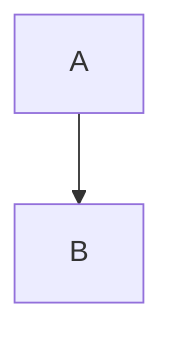
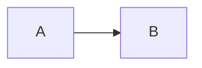

# API Contracts: Mermaid.js Diagram Support

**Feature**: 002-mermaid-diagrams  
**Date**: 2025-12-01  
**Phase**: 1 - Design & Contracts

## Overview

This document defines the internal API contracts for the Mermaid diagram feature. Since this feature operates entirely within the renderer process, there are no IPC contracts. Instead, this defines component interfaces, hook APIs, and integration points.

---

## 1. Tiptap Extension API

### Extension Registration
```typescript
// Location: src/renderer/editor/mermaid-extension.ts

import { Node } from '@tiptap/core';
import { MermaidDiagramAttributes } from '@/shared/types/mermaid';

export interface MermaidDiagramOptions {
  /**
   * Whether to enable drag-and-drop reordering
   * @default true
   */
  draggable?: boolean;
  
  /**
   * Custom validation function
   * @default Internal Mermaid validation
   */
  validate?: (code: string) => Promise<boolean>;
  
  /**
   * Callback when diagram is inserted
   */
  onInsert?: (attrs: MermaidDiagramAttributes) => void;
  
  /**
   * Callback when diagram is updated
   */
  onUpdate?: (attrs: MermaidDiagramAttributes) => void;
  
  /**
   * Callback when diagram is deleted
   */
  onDelete?: (id: string) => void;
}

export const MermaidDiagram: Node<MermaidDiagramOptions>;
```

### Extension Commands
```typescript
// Commands added to Tiptap editor

editor.commands.insertMermaidDiagram(code: string, caption?: string): boolean

/**
 * Insert a new Mermaid diagram at current cursor position
 * @param code - Mermaid.js code
 * @param caption - Optional caption
 * @returns true if successful
 */

editor.commands.updateMermaidDiagram(id: string, code: string): boolean

/**
 * Update an existing diagram's code
 * @param id - Diagram node ID
 * @param code - New Mermaid.js code
 * @returns true if successful
 */

editor.commands.deleteMermaidDiagram(id: string): boolean

/**
 * Delete a diagram by ID
 * @param id - Diagram node ID
 * @returns true if successful
 */
```

**Usage Example**:
```typescript
// Insert new diagram
editor.chain()
  .focus()
  .insertMermaidDiagram('graph TD; A-->B')
  .run();

// Update existing diagram
editor.commands.updateMermaidDiagram('mermaid-123', 'graph LR; A-->B-->C');
```

---

## 2. useMermaid Hook API

### Hook Interface
```typescript
// Location: src/renderer/hooks/useMermaid.ts

export interface UseMermaidReturn {
  /**
   * Render Mermaid code to SVG in a container element
   * @param code - Mermaid.js code
   * @param element - HTML element to render into
   * @returns Promise that resolves when rendering complete
   * @throws Error if rendering fails
   */
  renderDiagram: (code: string, element: HTMLElement) => Promise<void>;
  
  /**
   * Validate Mermaid syntax
   * @param code - Mermaid.js code to validate
   * @returns Validation result with error details
   */
  validateMermaid: (code: string) => Promise<MermaidValidationResult>;
  
  /**
   * Whether Mermaid library is loaded
   */
  isLoaded: boolean;
  
  /**
   * Whether an operation is in progress
   */
  isLoading: boolean;
  
  /**
   * Last error that occurred
   */
  error: Error | null;
  
  /**
   * Clear error state
   */
  clearError: () => void;
}

export function useMermaid(): UseMermaidReturn;
```

**Usage Example**:
```typescript
const { renderDiagram, validateMermaid, isLoaded } = useMermaid();

// Validate before inserting
const result = await validateMermaid(code);
if (result.isValid) {
  // Insert diagram
}

// Render in component
useEffect(() => {
  if (containerRef.current && code) {
    renderDiagram(code, containerRef.current);
  }
}, [code]);
```

---

## 3. MermaidModal Component API

### Component Props
```typescript
// Location: src/renderer/components/editor/MermaidModal.tsx

export interface MermaidModalProps {
  /**
   * Whether modal is open
   */
  open: boolean;
  
  /**
   * Callback when modal closes (via cancel, escape, or backdrop click)
   */
  onClose: () => void;
  
  /**
   * Initial code to populate editor (empty for new diagram)
   */
  initialCode?: string;
  
  /**
   * Callback when user saves diagram
   * @param code - The Mermaid code
   * @param caption - Optional caption
   */
  onSave: (code: string, caption?: string) => void;
  
  /**
   * Optional: Diagram ID for edit mode
   * Used for analytics/tracking
   */
  diagramId?: string;
  
  /**
   * Optional: Custom validation function
   * Overrides default Mermaid validation
   */
  customValidation?: (code: string) => Promise<{ isValid: boolean; error?: string }>;
}

export function MermaidModal(props: MermaidModalProps): JSX.Element;
```

**Usage Example**:
```typescript
const [modalOpen, setModalOpen] = useState(false);

const handleSave = (code: string, caption?: string) => {
  editor.chain()
    .focus()
    .insertMermaidDiagram(code, caption)
    .run();
  setModalOpen(false);
};

return (
  <MermaidModal
    open={modalOpen}
    onClose={() => setModalOpen(false)}
    initialCode=""
    onSave={handleSave}
  />
);
```

---

## 4. MermaidNodeView Component API

### Component Props
```typescript
// Location: src/renderer/editor/MermaidNodeView.tsx

export interface MermaidNodeViewProps {
  /**
   * ProseMirror node data
   */
  node: {
    attrs: MermaidDiagramAttributes;
  };
  
  /**
   * Function to update node attributes
   */
  updateAttributes: (attrs: Partial<MermaidDiagramAttributes>) => void;
  
  /**
   * Function to delete this node
   */
  deleteNode: () => void;
  
  /**
   * Tiptap editor instance
   */
  editor: Editor;
  
  /**
   * Whether node is selected
   */
  selected: boolean;
  
  /**
   * Node position in document
   */
  getPos: () => number;
}

export function MermaidNodeView(props: MermaidNodeViewProps): JSX.Element;
```

**Internal Behavior**:
- Renders diagram on mount and when `node.attrs.code` changes
- Shows loading state while rendering
- Displays error state if rendering fails
- Handles click to open edit modal
- Applies hover/selection styles based on `selected` prop

---

## 5. Markdown Serializer Contract

### Serialization

**Input**: Tiptap MermaidDiagram node
```typescript
{
  type: 'mermaidDiagram',
  attrs: {
    code: 'graph TD\n  A-->B',
    id: 'mermaid-123',
    caption: 'Example diagram'
  }
}
```

**Output**: Markdown fenced code block
```markdown


_Example diagram_
```

**Implementation**:
```typescript
// In src/renderer/editor/markdown-serializer.ts

mermaidDiagram: (state, node) => {
  state.write('```mermaid\n');
  state.text(node.attrs.code, false);
  state.ensureNewLine();
  state.write('```');
  state.closeBlock(node);
  
  // Add caption if present
  if (node.attrs.caption) {
    state.write(`\n_${node.attrs.caption}_\n`);
  }
}
```

### Parsing

**Input**: Markdown fenced code block
```markdown

```

**Output**: Tiptap node structure
```typescript
{
  type: 'mermaidDiagram',
  attrs: {
    code: 'graph LR\n  A-->B',
    id: 'mermaid-1701446400000-abc123', // Generated
    createdAt: 1701446400000, // Generated
    updatedAt: 1701446400000 // Generated
  }
}
```

**Implementation**: Uses existing markdown-it parser with custom token handler

---

## 6. PDF Rendering Contract

### Input Contract
```typescript
// Location: src/main/pdf/markdown-parser.ts

interface ParsedMermaidElement {
  type: 'mermaid';
  code: string;
  caption?: string;
}
```

### Output Contract
```typescript
// Location: src/main/pdf/components/MermaidDiagram.tsx

interface MermaidDiagramProps {
  /**
   * Mermaid code to render
   */
  code: string;
  
  /**
   * Optional caption to display below diagram
   */
  caption?: string;
  
  /**
   * Maximum width in PDF units
   * @default 500
   */
  maxWidth?: number;
}

export function MermaidDiagram(props: MermaidDiagramProps): JSX.Element;
```

### Component Behavior
- Renders Mermaid code to SVG
- Embeds SVG in PDF using `<Svg>` component from @react-pdf/renderer
- Falls back to error message if rendering fails
- Displays caption below diagram if provided
- Scales diagram to fit within maxWidth

---

## 7. Integration Points

### Editor Toolbar Integration
```typescript
// Location: src/renderer/components/editor/TiptapEditor.tsx

<ToolbarButton
  icon={<DiagramIcon />}
  label="Insert Diagram"
  onClick={() => setMermaidModalOpen(true)}
  disabled={!editor?.can().insertMermaidDiagram()}
  tooltip="Insert Mermaid Diagram (Ctrl+Shift+D)"
/>
```

**Keyboard Shortcut**: 
```typescript
addKeyboardShortcuts() {
  return {
    'Mod-Shift-d': () => {
      // Open modal for new diagram
      this.options.onOpenModal?.();
      return true;
    }
  };
}
```

### Document Persistence
- Diagrams automatically persist via existing Tiptap document save mechanism
- No special handling needed (stored as JSON in document structure)

### PDF Export Trigger
- Uses existing PDF export pipeline
- Markdown serializer converts diagrams to fenced blocks
- PDF parser detects 'mermaid' language and creates diagram elements
- MermaidDiagram component renders in PDF

---

## 8. Error Handling Contract

### Validation Errors
```typescript
interface ValidationError {
  type: 'validation';
  message: string;
  code?: string; // Mermaid error code
  line?: number;
  column?: number;
}
```

**Handling**: Display in modal, prevent save, keep modal open

### Rendering Errors
```typescript
interface RenderError {
  type: 'render';
  message: string;
  diagramId: string;
}
```

**Handling**: Display inline in NodeView, allow document editing to continue

### PDF Export Errors
```typescript
interface PdfError {
  type: 'pdf';
  message: string;
  diagramCode: string;
}
```

**Handling**: Show error placeholder in PDF, include error message, continue PDF generation

---

## 9. Testing Contracts

### Unit Tests
```typescript
describe('MermaidDiagram Extension', () => {
  it('should insert diagram with valid code', () => {
    const code = 'graph TD; A-->B';
    editor.commands.insertMermaidDiagram(code);
    expect(editor.getJSON()).toMatchObject({
      type: 'doc',
      content: [
        {
          type: 'mermaidDiagram',
          attrs: { code }
        }
      ]
    });
  });
});

describe('useMermaid Hook', () => {
  it('should validate valid Mermaid code', async () => {
    const { result } = renderHook(() => useMermaid());
    const validation = await result.current.validateMermaid('graph TD; A-->B');
    expect(validation.isValid).toBe(true);
  });
  
  it('should reject invalid Mermaid code', async () => {
    const { result } = renderHook(() => useMermaid());
    const validation = await result.current.validateMermaid('invalid syntax');
    expect(validation.isValid).toBe(false);
    expect(validation.error).toBeTruthy();
  });
});
```

### Integration Tests
```typescript
describe('Mermaid PDF Export', () => {
  it('should render diagrams in PDF', async () => {
    const document = createDocumentWithDiagram('graph TD; A-->B');
    const pdf = await generatePDF(document);
    expect(pdf).toContainSVG();
  });
  
  it('should handle rendering errors gracefully', async () => {
    const document = createDocumentWithDiagram('invalid code');
    const pdf = await generatePDF(document);
    expect(pdf).toContainErrorPlaceholder();
  });
});
```

---

## 10. Performance Contracts

### SLA Commitments
- **Modal open time**: <200ms (modal UI appears)
- **Diagram insertion**: <5s (includes validation + render, per spec SC-001)
- **Diagram edit reopen**: <2s (modal opens with pre-loaded code, per spec SC-002)
- **PDF export**: <30s for 20 diagrams (per spec SC-008 performance goal)

### Resource Limits
- **Max diagrams per document**: 20 (soft limit, per spec)
- **Max diagram code size**: 50KB per diagram (reasonable for complex diagrams)
- **Mermaid library size**: ~800KB (lazy loaded)
- **Rendered SVG size**: ~10-50KB per diagram (typical)

### Timeout Policies
- **Validation timeout**: 5s (prevent infinite loops in complex diagrams)
- **Render timeout**: 10s per diagram (PDF generation)
- **User interaction timeout**: None (user can take as long as needed in modal)

---

## Version Compatibility

**Mermaid.js Version**: 
- Minimum: v10.0.0
- Recommended: v10.6.0+
- Breaking changes: Follow semantic versioning, lock to major version

**Tiptap Version**:
- Minimum: v2.0.0
- Current: v2.x (compatible with existing setup)

**React Version**:
- Current: v19.0.0 (per project constitution)

---

## Next Steps

1. Implement TypeScript interfaces in contracts
2. Create unit tests for each contract
3. Document integration points in quickstart guide
4. Generate tasks breakdown for implementation
