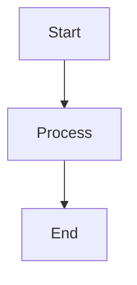

# Data Model: Mermaid.js Diagram Support

**Feature**: 002-mermaid-diagrams  
**Date**: 2025-12-01  
**Phase**: 1 - Design & Contracts

## Overview

This document defines the data structures, types, and relationships for the Mermaid diagram feature. All entities follow TypeScript strict mode and integrate with existing Tiptap/ProseMirror document structure.

---

## Core Entities

### 1. MermaidDiagram Node (Editor)

**Purpose**: Represents a Mermaid diagram embedded in the Tiptap editor document

**Schema Definition**:
```typescript
// Location: src/shared/types/mermaid.ts

export interface MermaidDiagramAttributes {
  /**
   * Raw Mermaid.js code defining the diagram
   * @example "graph TD\n  A-->B\n  B-->C"
   */
  code: string;
  
  /**
   * Unique identifier for this diagram instance
   * Used for rendering and React keys
   * @example "mermaid-1701446400000-abc123"
   */
  id: string;
  
  /**
   * Optional caption/title for the diagram
   * Displayed below diagram in editor and PDF
   */
  caption?: string;
  
  /**
   * Creation timestamp (Unix milliseconds)
   * Used for sorting and conflict resolution
   */
  createdAt: number;
  
  /**
   * Last modified timestamp (Unix milliseconds)
   * Updated on every edit
   */
  updatedAt: number;
}

export interface MermaidDiagramNode {
  type: 'mermaidDiagram';
  attrs: MermaidDiagramAttributes;
}
```

**Tiptap Node Configuration**:
```typescript
// Location: src/renderer/editor/mermaid-extension.ts

export const MermaidDiagram = Node.create<MermaidDiagramOptions>({
  name: 'mermaidDiagram',
  
  group: 'block', // Block-level element
  
  atom: true, // Atomic, cannot be split
  
  draggable: true, // Can be drag-dropped
  
  addAttributes() {
    return {
      code: {
        default: '',
        parseHTML: element => element.getAttribute('data-code') || '',
        renderHTML: attributes => ({ 'data-code': attributes.code })
      },
      id: {
        default: () => `mermaid-${Date.now()}-${Math.random().toString(36).substr(2, 9)}`,
        parseHTML: element => element.getAttribute('data-id'),
        renderHTML: attributes => ({ 'data-id': attributes.id })
      },
      caption: {
        default: null,
        parseHTML: element => element.getAttribute('data-caption'),
        renderHTML: attributes => attributes.caption ? { 'data-caption': attributes.caption } : {}
      },
      createdAt: {
        default: () => Date.now(),
        parseHTML: element => {
          const timestamp = element.getAttribute('data-created-at');
          return timestamp ? parseInt(timestamp, 10) : Date.now();
        },
        renderHTML: attributes => ({ 'data-created-at': attributes.createdAt.toString() })
      },
      updatedAt: {
        default: () => Date.now(),
        parseHTML: element => {
          const timestamp = element.getAttribute('data-updated-at');
          return timestamp ? parseInt(timestamp, 10) : Date.now();
        },
        renderHTML: attributes => ({ 'data-updated-at': attributes.updatedAt.toString() })
      }
    };
  },
  
  parseHTML() {
    return [
      {
        tag: 'div[data-type="mermaid-diagram"]',
        priority: 51 // Higher than default code blocks
      }
    ];
  },
  
  renderHTML({ HTMLAttributes }) {
    return ['div', mergeAttributes(HTMLAttributes, {
      'data-type': 'mermaid-diagram',
      'class': 'mermaid-diagram-node'
    })];
  },
  
  addNodeView() {
    return ReactNodeViewRenderer(MermaidNodeView);
  }
});
```

**Validation Rules**:
- `code`: Must be non-empty string, validated via `mermaid.parse()` before insertion
- `id`: Must be globally unique within document
- `caption`: Optional, max 200 characters
- `createdAt`/`updatedAt`: Must be valid Unix timestamps

**State Transitions**:
1. **Creation**: User clicks "Insert Diagram" → Modal opens → User enters code → Node inserted with new ID
2. **Edit**: User clicks diagram → Modal opens with current code → User modifies → Node updated with new `updatedAt`
3. **Delete**: User selects node and presses Delete → Node removed via ProseMirror transaction
4. **Undo/Redo**: ProseMirror transaction history automatically handles node state

**Relationships**:
- **Parent**: Tiptap document (ProseMirror Doc node)
- **Siblings**: Other block nodes (paragraphs, headings, images, etc.)
- **Children**: None (atomic node)

---

### 2. Mermaid Validation Result

**Purpose**: Represents validation state and error details for Mermaid code

**Type Definition**:
```typescript
// Location: src/shared/types/mermaid.ts

export interface MermaidValidationResult {
  /**
   * Whether the Mermaid code is syntactically valid
   */
  isValid: boolean;
  
  /**
   * Error message if validation failed
   * Null if isValid is true
   */
  error: string | null;
  
  /**
   * Line number where error occurred (if available)
   * Used to highlight error in modal editor
   */
  errorLine?: number;
  
  /**
   * Column number where error occurred (if available)
   */
  errorColumn?: number;
}

export type ValidationFunction = (code: string) => Promise<MermaidValidationResult>;
```

**Usage**:
```typescript
// In useMermaid hook
const validateMermaid = async (code: string): Promise<MermaidValidationResult> => {
  if (!code.trim()) {
    return { isValid: false, error: 'Diagram code cannot be empty' };
  }
  
  try {
    await mermaid.parse(code);
    return { isValid: true, error: null };
  } catch (error) {
    const message = error instanceof Error ? error.message : 'Invalid syntax';
    return { isValid: false, error: message };
  }
};
```

---

### 3. Mermaid Modal State

**Purpose**: Manages UI state for the diagram editor modal

**Type Definition**:
```typescript
// Location: src/renderer/components/editor/MermaidModal.tsx

export interface MermaidModalProps {
  /**
   * Whether modal is open
   */
  open: boolean;
  
  /**
   * Callback to close modal
   */
  onClose: () => void;
  
  /**
   * Initial diagram code (for editing existing diagram)
   * Empty string for new diagram
   */
  initialCode: string;
  
  /**
   * Callback when user accepts diagram
   * @param code - New diagram code
   */
  onSave: (code: string) => void;
  
  /**
   * Optional: Existing diagram ID (for edit mode)
   */
  diagramId?: string;
}

export interface MermaidModalState {
  /**
   * Current code in editor
   */
  code: string;
  
  /**
   * Validation result for current code
   */
  validation: MermaidValidationResult | null;
  
  /**
   * Whether validation is in progress
   */
  isValidating: boolean;
  
  /**
   * Whether Mermaid library is loaded
   */
  isLibraryLoaded: boolean;
}
```

---

### 4. PDF Diagram Element

**Purpose**: Represents diagram data for PDF generation

**Type Definition**:
```typescript
// Location: src/main/pdf/types.ts (or shared/types/mermaid.ts)

export interface PdfMermaidElement {
  /**
   * Element type identifier
   */
  type: 'mermaid';
  
  /**
   * Mermaid code to render
   */
  code: string;
  
  /**
   * Optional caption
   */
  caption?: string;
  
  /**
   * Rendered SVG string (generated during PDF creation)
   * Cached to avoid re-rendering same diagram
   */
  svg?: string;
  
  /**
   * Whether rendering failed
   */
  error?: string;
}
```

**Markdown Parser Integration**:
```typescript
// In src/main/pdf/markdown-parser.ts

// Detect mermaid fenced code blocks
if (token.type === 'fence' && token.info === 'mermaid') {
  const element: PdfMermaidElement = {
    type: 'mermaid',
    code: token.content,
    caption: extractCaption(token) // Optional caption from comment
  };
  elements.push(element);
}
```

---

## Data Flow Diagrams

### Diagram Insertion Flow
```
User clicks "Insert Diagram"
  → MermaidModal opens (initialCode = '')
  → User types Mermaid code
  → User clicks "Accept"
  → validateMermaid(code) runs
  → If valid:
      → editor.chain().insertContent({ 
          type: 'mermaidDiagram',
          attrs: { 
            code,
            id: generateId(),
            createdAt: Date.now(),
            updatedAt: Date.now()
          }
        }).run()
      → Modal closes
      → MermaidNodeView renders diagram
  → If invalid:
      → Show error message
      → Keep modal open
```

### Diagram Edit Flow
```
User clicks MermaidNodeView
  → Get current code from node.attrs.code
  → MermaidModal opens (initialCode = current code)
  → User modifies code
  → User clicks "Accept"
  → validateMermaid(code) runs
  → If valid:
      → updateAttributes({ 
          code: newCode,
          updatedAt: Date.now()
        })
      → Modal closes
      → MermaidNodeView re-renders
  → If invalid:
      → Show error message
      → Keep modal open
```

### PDF Export Flow
```
User triggers PDF export
  → Serialize document via markdownSerializer
  → mermaidDiagram nodes → ```mermaid\n{code}\n```
  → markdown-parser.ts parses fenced blocks
  → Detect 'mermaid' language
  → Create PdfMermaidElement { type: 'mermaid', code }
  → MermaidDiagram component renders:
      → await mermaid.render(id, code)
      → Extract SVG string
      → <Svg src={svg} />
  → PDF generated with embedded diagrams
```

---

## Storage Format

### Document JSON (Tiptap ProseMirror)
```json
{
  "type": "doc",
  "content": [
    {
      "type": "paragraph",
      "content": [{ "type": "text", "text": "Here's a flowchart:" }]
    },
    {
      "type": "mermaidDiagram",
      "attrs": {
        "code": "graph TD\n  A[Start] --> B[Process]\n  B --> C[End]",
        "id": "mermaid-1701446400000-abc123",
        "caption": "Simple workflow",
        "createdAt": 1701446400000,
        "updatedAt": 1701446500000
      }
    },
    {
      "type": "paragraph",
      "content": [{ "type": "text", "text": "More content..." }]
    }
  ]
}
```

### Markdown Export (for File Save)
```markdown
Here's a flowchart:



_Simple workflow_

More content...
```

---

## Type Safety Checklist

- [x] All node attributes have TypeScript interfaces
- [x] Validation functions return typed results
- [x] Modal props and state are fully typed
- [x] PDF element types defined
- [x] No `any` types used (except error handling)
- [x] Strict mode compatible
- [x] IPC contracts typed (not needed for this feature)

---

## Migration Considerations

**Backward Compatibility**: 
- Feature introduces new node type, doesn't modify existing nodes
- Documents without diagrams remain unchanged
- Opening old documents in new version: No issues (diagrams just won't render until feature used)
- Opening new documents in old version: Diagrams appear as unrecognized nodes (gracefully ignored by ProseMirror)

**Data Migration**: None required (new feature)

**Version Compatibility**: 
- Mermaid.js versioning follows semantic versioning
- Lock to major version (v10.x) to avoid breaking changes
- Document Mermaid version in package.json

---

## Performance Considerations

**Memory**:
- Each diagram node: ~1-5KB (depending on code length)
- Rendered SVG: ~10-50KB per diagram
- 20 diagrams max: ~1MB total memory footprint

**Rendering**:
- Initial render: Lazy load Mermaid (~800KB), then render all visible diagrams
- Re-render on edit: Single diagram only (~50-200ms)
- PDF generation: Batch render all diagrams (~100-500ms per diagram)

**Caching**:
- Mermaid library: Load once, cache globally
- Rendered SVGs: Cache during PDF generation to avoid duplicate renders
- Validation results: No caching (validate on demand)

---

## Next Steps

1. Implement TypeScript interfaces in `/src/shared/types/mermaid.ts`
2. Create Tiptap extension with schema definition
3. Build MermaidNodeView React component
4. Implement validation hook
5. Create modal UI component
6. Integrate with markdown serializer
7. Add PDF rendering component
