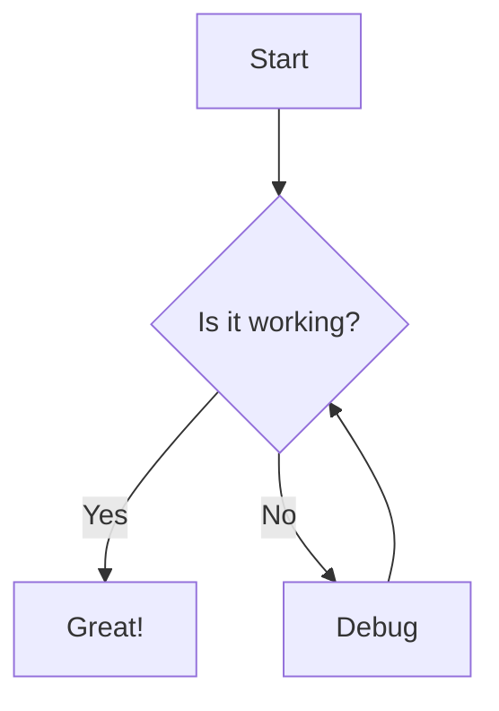
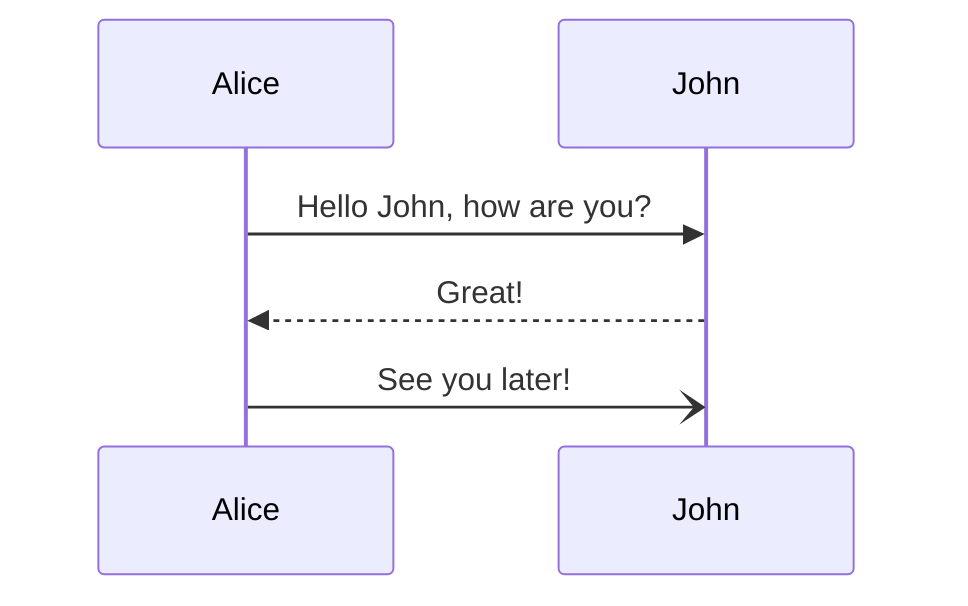
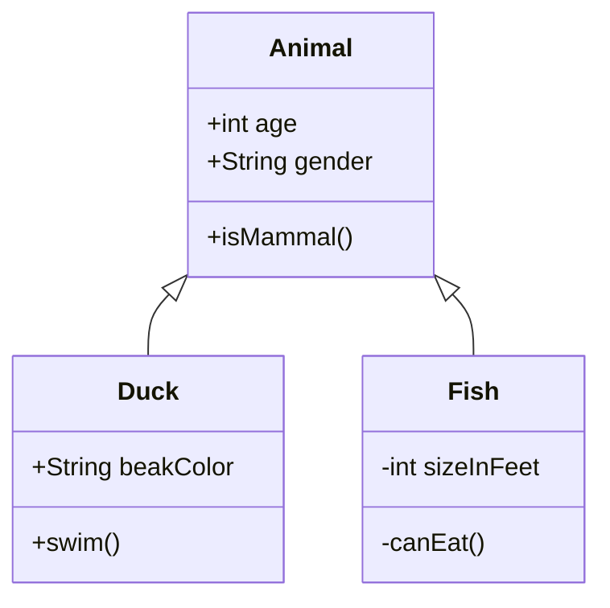
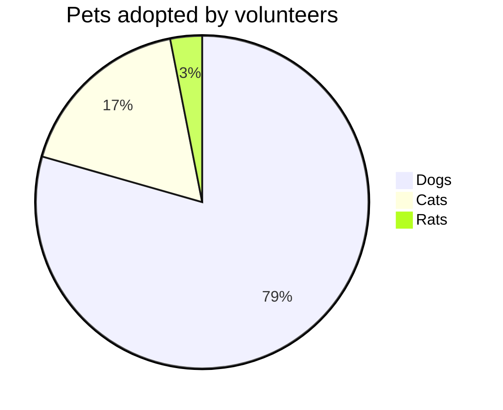
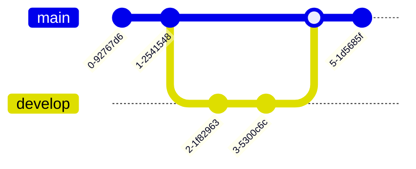

# Test Document: Valid Mermaid Diagrams

This document contains multiple valid Mermaid diagrams for testing PDF export.

## 1. Simple Flowchart

*Figure 1: Basic decision flowchart*

## 2. Sequence Diagram

*Figure 2: Simple conversation sequence*

## 3. Class Diagram

*Figure 3: Animal class hierarchy*

## 4. Pie Chart

*Figure 4: Pet adoption statistics*

## 5. Git Graph

*Figure 5: Git branching workflow*

## Conclusion

All diagrams above should render correctly in the PDF export.
